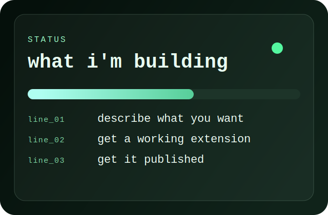
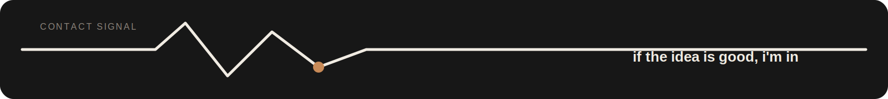

<div align="center">
  
</div>

<div align="center">

# amirlan.exe

### 15 y/o founder-engineer building products faster than most people finish mockups

<p>
  <a href="https://extensy.dev"></a>
  <a href="https://x.com/amirlankalm"></a>
  <a href="https://instagram.com/amirkasobased"></a>
</p>

<sub>operator status: shipping browser tools, backend systems, and whatever else gets the idea live</sub>

</div>

---

<table>
  <tr>
    <td width="58%" valign="top">

## what i'm doing

I co-founded **[Extensy](https://extensy.dev)** to make browser extension creation feel unfair.

You describe the thing you want.
We generate the extension.
We help get it published.

I like building products that feel immediate, sharp, and a little bit dangerous.

```text
current loop
idea -> build -> ship -> learn -> repeat louder
```

  </td>
    <td width="42%" valign="top">
      
    </td>
  </tr>
</table>

<div align="center">
  
</div>

## stack

<div align="center">
  
</div>

<p align="center">
  
  
  
  
  
  
  
</p>

<table>
  <tr>
    <td width="50%" valign="top">

## mode

- building tools people can actually use
- obsessed with shipping speed
- product taste matters as much as code
- prefer real things over fake demos

  </td>
    <td width="50%" valign="top">

## open tabs in my brain

- AI products
- browser extensions
- infra that scales without getting weird
- interfaces with taste

  </td>
  </tr>
</table>

<div align="center">
  
</div>

## find me

<div align="center">
  <a href="https://extensy.dev">
    
  </a>
  <a href="https://x.com/amirlankalm">
    
  </a>
  <a href="https://instagram.com/amirkasobased">
    
  </a>
</div>

<p align="center">
  if you want to try <b>Extensy</b>, message me and i'll probably hook you up with credits.
</p>

<div align="center">
  
</div>
